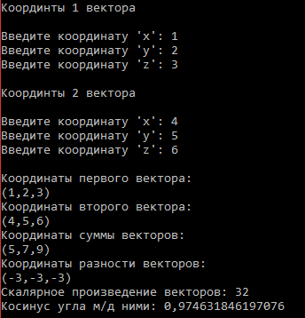

# Пример простейшего класса
<h2>Задача</h2>

  Составить описание класса для вектора, заданного координатами его концов в трехмерном пространстве. Обеспечить операции сложения и вычитания векторов с получением нового вектора (суммы или разности), вычисления скалярного произведения двух векторов, длины вектора, косинуса угла между векторами. 

<h2>Результат работы программы</h2>

